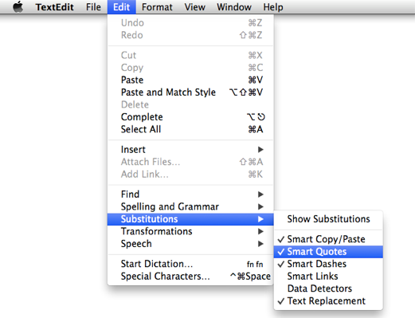
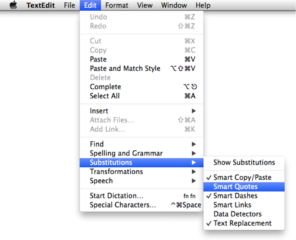

km-for-smart-quotes
===================

Two Keyboard Maestro macros: one to check the status of “Smart Quotes” and one to toggle it.

### What Are “Smart Quotes”? ###

Smart Quotes are what Mac OS X calls “typographer’s quotes” which are curled instead of the straight variants. “Smart” quotes are great, unless you’re writing HTML or some kind of programming code which _requires_ straight quotes.

* “These are smart double quotes.”
* ‘These are smart single quotes.’
* "These are straight double quotes."
* 'These are straight single quotes.'

You can find this setting in most Mac OS X apps by looking under the Edit » Substitutions menu. This shows them turned on:

And this shows them turned off:

You can disable Smart Quotes system-wide in System Preferences » Keyboard » Text (that’s in 10.9, search System Preferences for “substitutions” to find it in other versions of OS X), but I like being able to use them when I want them, and turning them off when I don’t.

So I created [Smart-Quotes-Toggle-On-Off.kmmacros][].

Since I’m toggling this on/off, I also need some way to check its current status, so I wrote a macro for that too: [Smart-Quotes-Check-Status.kmmacros][].

### How to Use These Macros ###

[Download the zip file from Github][] and import them into Keyboard Maestro by double clicking on the `.kmmacros` files.

By default, the shortcut for checking the status is <kbd>⌥</kbd>+<kbd>&#39;</kbd> and will show the current status using an OS X notification.

The shortcut for toggling smart quotes\* is <kbd>⌃</kbd>+<kbd>⌥</kbd>+<kbd>⇧</kbd>+<kbd>⌘</kbd>+<kbd>&#39;</kbd> which will toggle them (turn them off if they’re on, or turn them on if they’re off) and show an OS X notification to let you know the new status.

(\* That seem like a lot of keys, but <kbd>Caps Lock</kbd> equals  <kbd>⌃</kbd>+<kbd>⌥</kbd>+<kbd>⇧</kbd>+<kbd>⌘</kbd>  on my Mac, thanks to [Brett Terpstra’s “A useful Caps Lock key”](http://brettterpstra.com/2012/12/08/a-useful-caps-lock-key/), so for me I just press <kbd>Caps Lock</kbd>+<kbd>&#39;</kbd>. 
I talked about this “Hyper Key” on [Mac Power Users episode 181][] if you’d like to hear more about it. Of course, you can easily change the shortcuts using Keyboard Maestro, you don’t have to use mine.)

### There Are a Few Provisos, a Couple of *Quid Pro Quos*. ###

This will only work in apps which use the standard OS X menu for Smart Quotes. Other apps, including TextEdit, Microsoft Word, and at least some versions of Pages, have their own settings for this feature.

### Bonus Tips and Tricks ###

Some smart person on [Ask Different](http://apple.stackexchange.com/questions/40215/how-can-i-dynamically-choose-smart-or-non-smart-quotes) pointed out that on the U.S. standard keyboard layout:

* <kbd>Option</kbd> + <kbd>[</kbd>  = open printer’s quote: “ 

* <kbd>Shift</kbd> + <kbd>Option</kbd> + <kbd>[</kbd>  =  close printer’s quote: ” 

* <kbd>Option</kbd> + <kbd>]</kbd>  = open printer’s apostrophe: ‘

* <kbd>Shift</kbd> + <kbd>Option</kbd> + <kbd>]</kbd> = close printer’s apostrophe: ’ 

If you want to muck about with keybindings, you can even [remap those keyboard shortcuts](http://www.danandcheryl.com/2010/08/how-to-type-curly-quotes-in-mac-os-x).

[Mac Power Users episode 181]: http://www.macpowerusers.com/2014/03/09/mac-power-users-181-automation-workflows-with-tj-luoma/

[Smart-Quotes-Toggle-On-Off.kmmacros]: Smart-Quotes-Toggle-On-Off.kmmacros

[Smart-Quotes-Check-Status.kmmacros]: Smart-Quotes-Check-Status.kmmacros

[Download the zip file from Github]: pathto.zip

